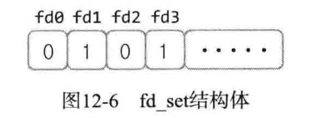
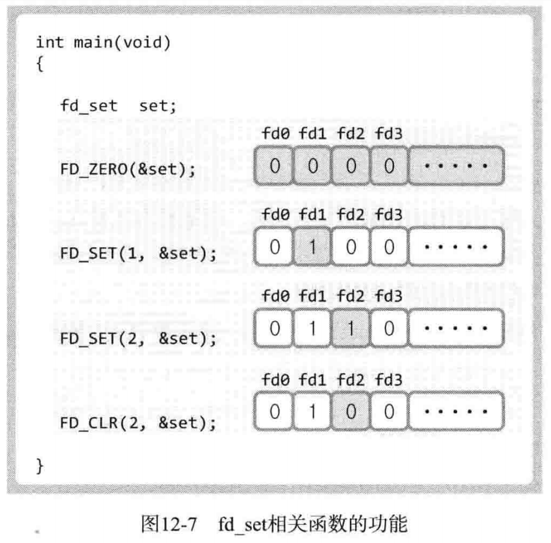
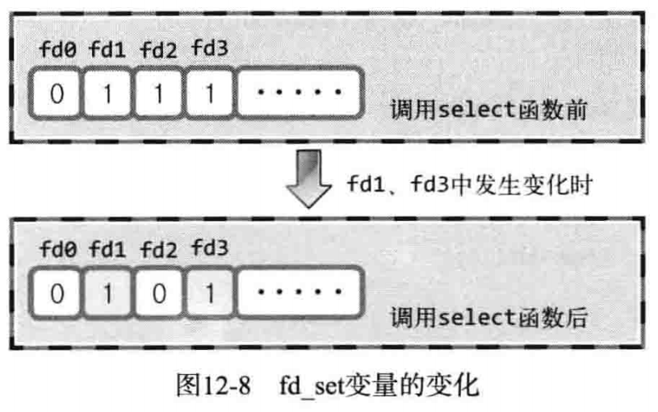

# I/O复用

多进程方式跳过

## 基于I/O复用的服务器端

接下来讨论并发服务器实现方法的延伸。如果有读者已经跳过第10章和第11章，那就只需把本章内容当做并发服务器实现的第一种方法即可。将要讨论的内容中包含一部分与多进程服务器端的比较，跳过第10章和第11章的读者简单浏览即可。

**多进程服务器端的缺点和解决方法**

为了构建并发服务器、只要有客户端连接请求就会创建新进程。这的确是实际操作中采用的一种方案，但并非十全十美，因为创建进程时需要付出极大代价。这需要大量的运算和内存空间，由于每个进程都具有独立的内存空间，所以相互间的数据交换也要求采用相对复杂的方法（IPC 属于相对复杂的通信方法）。各位应该也感到需要IPC时会提高编程难度。

“那有何解决方案？能否在不创建进程的同时向多个客户端提供服务？”

当然能！本节讲解的I/O复用就是这种技术。大家听到有这种方法是否感到一阵兴奋？但请不要过于依赖该模型！该方案并不适用于所有情况，应当根据目标服务器端的特点采用不同实现方法。下面先理解"复用"（Multiplexing）的意义。

**理解复用**

“复用”在电子及通信工程领域很常见，向这些领域的专家询问其概念时，他们会亲切地进行如下说明：

"在1个通信频道中传递多个数据（信号）的技术。"能理解吗？不能的话就再看看"复用"的含义。

“为了提高物理设备的效率，用最少的物理要素传递最多数据时使用的技术。”

上述两种说法内容完全一致，只是描述方式有所区别。

**复用技术在服务器端的应用**

服务器端引入复用技术可以减少所需进程数。引入复用技术，可以减少进程数。重要的是，无论连接多少客户端，提供服务的进程只有1个。

> 关于I/O复用服务器端的另一种理解
>
> 某教室中有10名学生和1位教师，这些孩子并非等闲之辈，上课时不停地提问。学校没办法，只能给每个学生都配1位教师，也就是说教室中现有10位教师。此后，只要有新的转校生，就会增加1位教师，因为转校生也喜欢提问。这个故事中，如果把学生当作客户端，把教师当作与客户端进行数据交换的服务器端进程，则该教室的运营方式为多进程服务器端方式。
> 有一天，该校来了位具有超能力的教师。这位教师可以应对所有学生的提问，而且回答速度很快，不会让学生等待。因此，学校为了提高教师效率，将其他老师转移到了别的班。现在，学生提问前必须举手，教师确认举手学生的提问后再回答问题。也就是说，现在的教室以I/O复用方式运行。
> 虽然例子有些奇怪，但可以通过它理解I/O复用技法：教师必须确认有无举手学生，同样，I/O复用服务器端的进程需要确认举手（收到数据）的套接字，并通过举手的套接字接收数据。

## 理解 select函数并实现服务器端

运用select函数是最具代表性的实现复用服务器端方法。Windows平台下也有同名函数提供相同功能，因此具有良好的移植性。

**select 函数的功能和调用顺序**

使用select函数时可以将多个文件描述符集中到一起统一监视，项目如下。

- 是否存在套接字接收数据？
- 无需阻塞传输数据的套接字有哪些？
- 哪些套接字发生了异常？

> 监视顽称为“事件”（event）
>
> 上述监视项称为"事件"。发生监视项对应情况时，称"发生了事件"。这是最常见的表达，希望各位熟悉。另外，本章不会使用术语"事件"，而与本章密切相关的第17章将使用该术语，希望大家理解"事件"的含义，以及“发生事件”的意义。

select函数的使用方法与一般函数区别较大，更准确地说，它很难使用。但为了实现I/O复用服务器端，我们应掌握select函数，并运用到套接字编程中。认为"select函数是I/O复用的全部内容"也并不为过。接下来介绍select函数的调用方法和顺序。

1. 步骤一
   1. 设置文件描述符
   2. 指定监视范围
   3. 设置超时
2. 步骤二
   1. 调用select函数
3. 步骤三
   1. 查看调用结果

可以看到，调用selet函数前需要一些准备工作，调用后还需查看结果。接下来按照上述顺序逐一讲解。

**设置文件描述符**

利用select函数可以同时监视多个文件描述符。当然，监视文件描述符可以视为监视套接字。此时首先需要将要监视的文件描述符集中到一起。集中时也要按照监视项（接收、传输、异常）进行区分，即按照上述3种监视项分成3类。

使用fd_set数组变量执行此项操作，如图12-6所示。该数组是存有0和1的位数组。



图12-6中最左端的位表示文件描述符0(所在位置)。如果该位设置为1，则表示该文件描述符是监视对象。那么图中哪些文件描述符是监视对象呢?很明显，是文件描述符1和3。

是否应当通过文件描述符的数字直接将值注册到fd_set变量?

当然不是!针对fd_set变量的操作是以位为单位进行的，这也意味着直接操作该变量会比较繁琐。难道要求各位自己完成吗?实际上，在fd_set变量中注册或更改值的操作都由下列宏完成

- FD_ZERO(fd_set *fdset)：将fd_set变量的所有位初始化为0。
- FD SET(int fd，fd_set *fdset)：在参数fdset指向的变量中注册文件描述符fa的信息。
- FD_CLR(int fd，fd_set *fdset)： 从参数fdset指向的变量中清除文件描述符fd的信息。
- FD_ISSET(int fd，fd_set *fdset)：若参数fiset指向的变量中包含文件描述符d的信息，则返回“真”。

上述函数中，FD_ISSET用于验证select函数的调用结果。通过图12-7解释这些函数的功能，简洁易懂，无需赘述。



**设置检查（监视）范围及超时**

简单介绍select函数。

```c
#include <sys/select.h>
#include <sys/time.h>
int select(int maxfd, fd_set *readset, fd_set *writeset, fd_set *exceptset, const struct timeval *timeout);
// 成功时返回大于θ的值，失败时返回-1。

// maxfd            监视对象文件描述符数量。
// readset          将所有关注"是否存在待读取数据"的文件描述符注册到fd_set型变量，并传递其地址值。
// writeset         将所有关注"是否可传输无阻塞数据"的文件描述符注册到fd_set型变量，并传递其地址值。
// exceptset        将所有关注"是否发生异常"的文件描述符注册到fd_set型变量，并传递其地址值。
// timeout          调用select函数后，为防止陷入无限阻塞的状态，传递超时（time-out）信息。
// 返回值           发生错误时返回-1，超时返回时返回0。因发生关注的事件返回时，返回大于0的值，该值是发生事件的文件描述符数。

```

如上所述，select函数用来验证3种监视项的变化情况。根据监视项声明3个fd set型变量，分别向其注册文件描述符信息，并把变量的地址值传递到上述函数的第二到第四个参数。但在此之前（调用select函数前）需要决定下面2件事。

“文件描述符的监视（检查）范围是？”

“如何设定select函数的超时时间？”

第一，文件描述符的监视范围与select函数的第一个参数有关。实际上，select函数要求通过第一个参数传递监视对象文件描述符的数量。因此，需要得到注册在fd_set变量中的文件描述符数。但每次新建文件描述符时，其值都会增1，故只需将最大的文件描述符值加1再传递到select函数即可。加1是因为文件描述符的值从0开始。

第二，select函数的超时时间与select函数的最后一个参数有关，其中timeval结构体定义如下。

```c
struct timeval
{
    long tv_sec;            // seconds
    long tv_usec;           // microseconds
}
```

本来select函数只有在监视的文件描述符发生变化时才返回。如果未发生变化，就会进入阻塞状态。指定超时时间就是为了防止这种情况的发生。通过声明上述结构体变量，将秒数填人tv_sec成员，将毫秒数填入tv_usec成员，然后将结构体的地址值传递到select函数的最后一个参数。此时，即使文件描述符中未发生变化，只要过了指定时间，也可以从函数中返回。不过这种情况下，select函数返回0。因此，可以通过返回值了解返回原因。如果不想设置超时，则传递NULL 参数。

**调用select函数后查看结果**

虽未给出具体示例，但图12-5中的步骤一"select函数调用前的所有准备工作"已讲解完毕，同时也介绍了select函数。而函数调用后查看结果也同样重要。我们已讨论过select函数的返回值，如果返回大于0的整数，说明相应数量的文件描述符发生变化。

> 文件描述符的变化
>
> 文件描述符变化是指监视的文件描述符中发生了相应的监视事件。例如，通过 select 的第二个参数传递的集合中存在需要读数据的描述符时，就意味着文件描述符发生变化。

select函数返回正整数时，怎样获知哪些文件描述符发生了变化？向select函数的第二到第四个参数传递的fd set变量中将产生如图12-8所示变化，获知过程并不难。



由图12-8可知，select函数调用完成后，向其传递的fd_set变量中将发生变化。原来为1的所有位均变为0，但发生变化的文件描述符对应位除外。因此，可以认为值仍为1的位置上的文件描述符发生了变化。

也就是说，调用完函数后，值仍为1的描述符是发生了变化的。

**select函数调用示例**

下面通过示例把select函数所有知识点进行整合，希望各位通过如下示例完全理解之前的内容。


