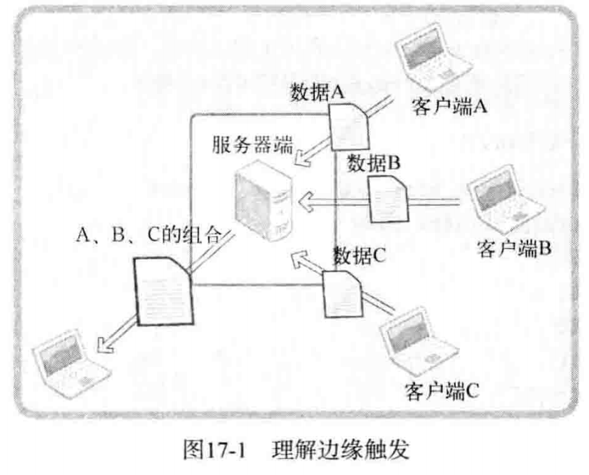

# 优于select的epoll

## epoll 理解及应用

select复用方法其实由来已久，因此，利用该技术后，无论如何优化程序性能也无法同时接入上百个客户端（当然，硬件性能不同，差别也很大）。这种select方式并不适合以Web服务器端开发为主流的现代开发环境，所以要学习Linux平台下的epoll。

**基于select的I/O复用技术速度慢的原因**

第12章曾经实现过基于select的I/O复用服务器端，很容易从代码上分析出不合理的设计，最主要的两点如下。

- 调用select函数后常见的针对所有文件描述符的循环语句。
- 每次调用select函数时都需要向该函数传递监视对象信息。

上述两点可以从第12章示例echo selectserv.c的第45、49行及第54行代码得到确认。调用select 函数后，并不是把发生变化的文件描述符单独集中到一起，而是通过观察作为监视对象的fd_set 变量的变化，找出发生变化的文件描述符（示例echo selectserv.c的第54、56行），因此无法避免针对所有监视对象的循环语句。而且，作为监视对象的fd set变量会发生变化，所以调用select函数前应复制并保存原有信息（参考echo selectserv.c的第45行），并在每次调用select函数时传递新的监视对象信息。

各位认为哪些因素是提高性能的更大障碍？是调用select函数后常见的针对所有文件描述符对象的循环语句？还是每次需要传递的监视对象信息？


只看代码的话很容易认为是循环。但相比于循环语句，更大的障碍是每次传递监视对象信息。因为传递监视对象信息具有如下含义：

"每次调用select函数时向操作系统传递监视对象信息。"

应用程序向操作系统传递数据将对程序造成很大负担，而且无法通过优化代码解决，因此将成为性能上的致命弱点。

“那为何需要把监视对象信息传递给操作系统呢？”

有些函数不需要操作系统的帮助就能完成功能，而有些则必须借助于操作系统。假设各位定义了四则运算相关函数，此时无需操作系统的帮助。但select函数与文件描述符有关，更准确地说，是监视套接字变化的函数。而套接字是由操作系统管理的，所以select函数绝对需要借助于操作系统才能完成功能。select函数的这一缺点可以通过如下方式弥补：

“仅向操作系统传递1次监视对象，监视范围或内容发生变化时只通知发生变化的事项。”

这样就无需每次调用select函数时都向操作系统传递监视对象信息，但前提是操作系统支持这种处理方式（每种操作系统支持的程度和方式存在差异）。Linux的支持方式是epoll，Windows 的支持方式是IOCP。

**select也有优点**

知道这些内容后，有些人可能对select函数感到失望，但大家应当掌握select函数。本章的epoll 方式只在Linux下提供支持，也就是说，改进的I/O复用模型不具有兼容性。相反，大部分操作系统都支持select函数。只要满足或要求如下两个条件，即使在Linux平台也不应拘泥于epoll。

- 服务器端接入者少。
- 程序应具有兼容性。

实际并不存在适用于所有情况的模型。各位应理解好各种模型的优缺点，并具备合理运用这些模型的能力。

**实现epol时必要的函数和结构体**

能够克服select函数缺点的epoll函数具有如下优点，这些优点正好与之前的select函数缺点相反。

- 无需编写以监视状态变化为目的的针对所有文件描述符的循环语句。
- 调用对应于select函数的epoll_wait函数时无需每次传递监视对象信息。

下面介绍epoll服务器端实现中需要的3个函数，希望各位结合epoll函数的优点理解这些函数的功能。

- epoll_create：创建保存epoll文件描述符的空间。
- epoll ctl：向空间注册并注销文件描述符。
- epoll_wait：与select函数类似，等待文件描述符发生变化。

select方式中为了保存监视对象文件描述符，直接声明了fd_set变量。但epoll方式下由操作系统负责保存监视对象文件描述符，因此需要向操作系统请求创建保存文件描述符的空间，此时使用的函数就是epoll_create。

此外，为了添加和删除监视对象文件描述符，select方式中需要FD_SET、FD_CLR函数。但在epoll方式中，通过epoll ctl函数请求操作系统完成。最后，select方式下调用select函数等待文件描述符的变化，而epoll中调用epoll_wait函数。还有，select方式中通过fi_set变量查看监视对象的状态变化（事件发生与否），而epoll方式中通过如下结构体epoll_event将发生变化的（发生事件的）文件描述符单独集中到一起。

```c
typedef union epoll_data {
    void* ptr;
    int fd;
    uint32_t u32;
    uint64_t u64;
} epoll_data_t;

struct epoll_event {
    uint32_t events;
    epoll_data_t data;
};

```

声明足够大的epoll event结构体数组后，传递给epollwait函数时，发生变化的文件描述符信息将被填入该数组。因此，无需像select函数那样针对所有文件描述符进行循环。

以上就是epoll中需要的函数和结构体。实际上，只要有select程序的编写经验，epoll程序的编写就并不难。接下来给出这些函数的详细说明。

**epoll_create**

epoll是从Linux的2.5.44版内核（操作系统的核心模块）开始引入的，所以使用epoll前需要验证Linux内核版本。但各位使用的Linux内核基本都是2.6以上的版本，所以这部分可以忽略。若有人怀疑自己的Linux版本过低，可以通过如下命令验证：

```shell
cat /proc/sys/kernel/osrelease
```

下面仔细观察epoll_create函数。

```c
#include <sys/epoll.h>
int epoll_create(int size);
// 成功时返回 epoll文件描述符，失败时返回-1。
// size epoll实例的大小。

```

调用epoll_create函数时创建的文件描述符保存空间称为"epoll例程"，但有些情况下名称不同，需要稍加注意。通过参数size传递的值决定epoll例程的大小，但该值只是向操作系统提的建议。换言之，size并非用来决定epoll例程的大小，而仅供操作系统参考。

> 操作系统将完全忽略传递给epoll_create的参数
>
> Linux 2.6.8之后的内核将完全忽略传入 epoll_create 函数的 size 参数，因为内核会根据情况调整 epoll例程的大小。但撰写本书时Linux版本未达到2.6.8，因此无法在忽略size参数的情况下编写程序。

epoll_create函数创建的资源与套接字相同，也由操作系统管理。因此，该函数和创建套接字的情况相同，也会返回文件描述符。也就是说，该函数返回的文件描述符主要用与于区分epoll 例程。需要终止时，与其他文件描述符相同，也要调用close函数。

**epoll_ctl**

生成epoll例程后，应在其内部注册监视对象文件描述符，此时使用epoll_ctl函数。

```c
#include <sys/epoll.h>
int epoll_ctl(int epfd, int op, int fd, struct epoll_event * event);
// 成功时返回0，失败时返回-1。
// epfd         用于注册监视对象的epoll例程的文件描述符。
// op           用于指定监视对象的添加、删除或更改等操作。
// fd           需要注册的监视对象文件描述符。
// event        监视对象的事件类型。

```

与其他epoll函数相比，该函数多少有些复杂，但通过调用语句就很容易理解。假设按照如下形式调用epoll_ctl函数：

```c
epoll_ctl(A, EPOLL_CTL_ADD, B, C);
```

第二个参数EPOLL_CTL_ADD意味着"添加"，因此上述语句具有如下含义：

"向epoll A中注册文件描述符B，主要目的是监视参数C中的事件。"

再介绍一个调用语句。

```c
epoll_ctl(A, EPOLL_CTL_DEL, B, NULL);
```

上述语句中第二个参数EPOLL_CTL_DEL指"删除"，因此该语句具有如下含义：

"从epoll A中删除文件描述符B。"

从上述调用语句中可以看到，从监视对象中删除时，不需要监视类型（事件信息），因此向第四个参数传递NULL。接下来介绍可以向epoll_ctl第二个参数传递的常量及含义。

- EPOLL_CTLADD：将文件描述符注册到epoll例程。
- EPOLL_CTL_DEL：从epoll例程中删除文件描述符。
- EPOLL_CTLMOD：更改注册的文件描述符的关注事件发生情况。

关于EPOLL CTL MOD常量稍后讲解（即使我不讲大家也自然能明白）。如前所述，向epoll_ctl的第二个参数传递EPOLL_CTL_DEL时，应同时向第四个参数传递NULL。但Linux2.6.9 之前的内核不允许传递NULL。虽然被忽略掉，但也应传递epoll_event结构体变量的地址值（本书示例将传递NULL）。其实这是Bug，但也没必要因此怀疑epoll的功能，因为我们使用的标准函数中也存在Bug。

下面讲解各位不太熟悉的epoll_ctl函数的第四个参数，其类型是之前将过的epoll_event结构体指针。

"啊？不是说epoll_event用于保存发生变化的（发生事件）的文件描述符吗？"

当然！如前所述，epoll_event结构体用于保存发生事件的文件描述符集合。但也可以在epoll 例程中注册文件描述符时，用于注册关注的事件。函数中epoll_event结构体的定义并不显眼，因此通过调用语句说明该结构体在epoll_ctl函数中的应用。

```c
struct epoll_event event;
event.events=EPOLLIN; //发生需要读取数据的情况（事件）时
event.data.fd=sockfd;
epoll_ctl(epfd, EPOLL_CTL_ADD, sockfd, &event);

```

上述代码将sockfd注册到epoll例程epfd中，并在需要读取数据的情况下产生相应事件。接下来给出epoll_event的成员events中可以保存的常量及所指的事件类型。

- EPOLLIN：需要读取数据的情况。
- EPOLLOUT：输出缓冲为空，可以立即发送数据的情况。
- EPOLLPRI：收到OOB数据的情况。
- EPOLLRDHUP：断开连接或半关闭的情况，这在边缘触发方式下非常有用。
- EPOLLERR：发生错误的情况。
- EPOLLET：以边缘触发的方式得到事件通知。
- EPOLLONESHOT：发生一次事件后，相应文件描述符不再收到事件通知。因此需要向epoll_ctl函数的第二个参数传递EPOLL_CTL_MOD，再次设置事件。

可以通过位或运算同时传递多个上述参数。关于“边缘触发”稍后将单独讲解，目前只需记住EPOLLIN即可。

**epoll_wait**

最后介绍与select函数对应的epoll_wait函数，epoll相关函数中默认最后调用该函数。

```c
#include <sys/epoll.h>
int epoll_wait(int epfd, struct epoll_event* events, int maxevents, int timeout);
// 成功时返回发生事件的文件描述符数，失败时返回-1。
// epfd         表示事件发生监视范围的epoll例程的文件描述符。
// events       保存发生事件的文件描述符集合的结构体地址值。
// maxevents    第二个参数中可以保存的最大事件数。
// timeout      以1/1000秒为单位的等待时间，传递-1时，一直等待直到发生事件。

```

该函数的调用方式如下。需要注意的是，第二个参数所指缓冲需要动态分配。

```c++
epoll_event* ep_events = new epoll_event[EPOLL_SIZE];
int event_cnt = epoll_wait(epfd, ep_events, EPOLL_SIZE, -1);
// ...
delete[] ep_events;

```

调用函数后，返回发生事件的文件描述符数，同时在第二个参数指向的缓冲中保存发生事件的文件描述符集合。因此，无需像select那样插入针对所有文件描述符的循环。

基于epoll的回声服务器端

以上就是基于epoll技术实现服务器端的所有理论说明，接下来给出基于epoll的回声服务器端示例。我通过更改第12章的echo_selectserv.c实现了该示例。当然，从头开始写也与下面给出的内容类似。但通过更改select示例理解二者差异将更有利于学习。

```c++
#include <arpa/inet.h>
#include <cstring>
#include <iostream>
#include <string>
#include <sys/epoll.h>
#include <sys/socket.h>
#include <unistd.h>

constexpr size_t BUF_SIZE = 1024;
constexpr size_t EPOLL_SIZE = 64;

int main(int argc, char* argv[])
{
    if (argc != 2) {
        std::cout << "Usage: " << argv[0] << " port" << std::endl;
        return 0;
    }

    // 创建套接字
    int servSock = socket(PF_INET, SOCK_STREAM, 0);
    if (servSock == -1) {
        std::cout << "socket 错误" << std::endl;
        return 0;
    }

    // 初始化地址信息
    sockaddr_in servAdr;
    std::memset(&servAdr, 0, sizeof(servAdr));
    servAdr.sin_family = AF_INET;
    servAdr.sin_addr.s_addr = htonl(INADDR_ANY);
    servAdr.sin_port = htons(std::atoi(argv[1]));

    // 绑定地址信息
    int stu = bind(servSock, (sockaddr*)&servAdr, sizeof(servAdr));
    if (stu == -1) {
        close(servSock);
        std::cout << "bind 错误" << std::endl;
        return 0;
    }

    // 进入监听状态
    stu = listen(servSock, 5);
    if (stu == -1) {
        close(servSock);
        std::cout << "listen 错误" << std::endl;
        return 0;
    }

    // 创建epoll
    int epFd = epoll_create(EPOLL_SIZE);
    if (epFd == -1) {
        close(servSock);
        std::cout << "epoll_create 错误" << std::endl;
        return 0;
    }

    // 初始化事件类型
    epoll_event epEvt;
    epEvt.events = EPOLLIN; // 类型指定为EPOLLIN
    epEvt.data.fd = servSock; // 目标套接字为servSock
    // 注册epoll事件
    epoll_ctl(epFd, EPOLL_CTL_ADD, servSock, &epEvt);

    char buf[BUF_SIZE] = { 0 };
    // 动态创建epoll_event数组，保存发生变化的事件
    epoll_event* evtArr = new epoll_event[EPOLL_SIZE];

    while (true) {
        // 返回事件数量
        int epCnt = epoll_wait(epFd, evtArr, EPOLL_SIZE, -1);
        if (epCnt == -1) {
            std::cout << "epoll_wait 错误" << std::endl;
            break;
        }

        // 遍历已触发的事件
        for (int i = 0; i < epCnt; ++i) {
            int sockId = evtArr[i].data.fd;
            // 如果变化的事件套接字等于服务端套接字，说明有新的请求
            if (sockId == servSock) {
                sockaddr_in clntAdr;
                socklen_t szAdr = sizeof(clntAdr);
                int clntSock = accept(servSock, (sockaddr*)&clntAdr, &szAdr);
                // 注册接收的套接字到epoll
                epEvt.events = EPOLLIN;
                epEvt.data.fd = clntSock;
                epoll_ctl(epFd, EPOLL_CTL_ADD, clntSock, &epEvt);

                std::string adrStr = inet_ntoa(clntAdr.sin_addr);
                std::cout << "接收" << adrStr << "的请求：" << clntSock << std::endl;
            } else {
                int strLen = read(sockId, buf, BUF_SIZE);
                if (strLen == 0) {
                    // 说明客户端断开连接
                    epoll_ctl(epFd, EPOLL_CTL_DEL, sockId, nullptr);
                    close(sockId);
                    std::cout << "客户端：" << sockId << "断开连接" << std::endl;
                } else {
                    buf[strLen] = { 0 };
                    std::cout << "接收客户端" << sockId << "的数据：" << buf << std::endl;
                    write(sockId, buf, strLen);
                }
            }
        }
    }

    close(epFd);
    close(servSock);

    delete[] evtArr;

    return 0;
}


```

之前解释过关键代码，而且程序结构与select方式没有区别，故省略代码说明。如果有些地方难以理解，说明未掌握本章之前的内容和select模型，建议复习。结合我的说明和select示例理解上述代码也是一种很好的学习方式。上述示例可以结合任意回声客户端运行，而且运行结果与其他回声服务器端/客户端程序没有差别，故省略。


## 条件触发和边缘触发

有些人学习epoll时往往无法正确区分条件触发（Level Trigger）和边缘触发（Edge Trigger），但只有理解了二者区别才算完整掌握epoll。有些人学习epoll时往往无法正确区分条件触发（Level Trigger）和边缘触发（Edge Trigger），但只有理解了二者区别才算完整掌握epoll。

**条件触发和边缘触发的区别在于发生事件的时间点**

首先给出示例帮助各位理解条件触发和边缘触发。观察如下对话，可以通过对话内容理解条件触发事件的特点。

- 儿子："妈妈，我收到了5000元压岁钱。"
- 妈妈：“恩，真棒！”

- 儿子："我给隔壁家秀熙买了炒年糕，花了2000元。
- 妈妈：“恩，做得好！”

- 儿子："妈妈，我还买了玩具，剩下500元。"
- 妈妈："用完零花钱就只能挨饿喽！"

- 儿子："妈妈，我还留着那500元没动，不会挨饿的。"
- 妈妈：“恩，很明智嘛！”


- 儿子："妈妈，我还留着那500元没动，我要攒起来。"
- 妈妈：“恩，加油！”

从上述对话可以看出，儿子从收到压岁钱开始一直向妈妈报告，这就是条件触发的原理。如果将上述对话中的儿子（儿子的钱包）换成输入缓冲，压岁钱换成输入数据，儿子的报告换成事件，则可以发现条件触发的特性。我将其整理如下：

"条件触发方式中，只要输入缓冲有数据就会一直通知该事件。"

例如，服务器端输入缓冲收到50字节的数据时，服务器端操作系统将通知该事件（注册到发生变化的文件描述符）。但服务器端读取20字节后还剩30字节的情况下，仍会注册事件。也就是说，条件触发方式中，只要输入缓冲中还剩有数据，就将以事件方式再次注册。接下来通过如下对话介绍边缘触发的事件特性。

- 儿子："妈妈，我收到了5000元压岁钱。"
- 妈妈：“恩，再接再厉。”

- 儿子：“……”
- 妈妈：“说话呀！压岁钱呢？不想回答吗？”


从上述对话可以看出，边缘触发中输入缓冲收到数据时仅注册1次该事件。即使输入缓冲中还留有数据，也不会再进行注册。

**掌握条件触发的事件特性**

接下来通过代码了解条件触发的事件注册方式。下列代码是稍微修改之前的echo_epollserv.c 示例得到的。epoll默认以条件触发方式工作，因此可以通过该示例验证条件触发的特性。

```c++
#include <arpa/inet.h>
#include <cstring>
#include <iostream>
#include <string>
#include <sys/epoll.h>
#include <sys/socket.h>
#include <unistd.h>

constexpr size_t BUF_SIZE = 4;
constexpr size_t EPOLL_SIZE = 64;

int main(int argc, char* argv[])
{
    if (argc != 2) {
        std::cout << "Usage: " << argv[0] << " port" << std::endl;
        return 0;
    }

    // 创建套接字
    int servSock = socket(PF_INET, SOCK_STREAM, 0);
    if (servSock == -1) {
        std::cout << "socket 错误" << std::endl;
        return 0;
    }

    // 初始化地址信息
    sockaddr_in servAdr;
    std::memset(&servAdr, 0, sizeof(servAdr));
    servAdr.sin_family = AF_INET;
    servAdr.sin_addr.s_addr = htonl(INADDR_ANY);
    servAdr.sin_port = htons(std::atoi(argv[1]));

    // 绑定地址信息
    int stu = bind(servSock, (sockaddr*)&servAdr, sizeof(servAdr));
    if (stu == -1) {
        close(servSock);
        std::cout << "bind 错误" << std::endl;
        return 0;
    }

    // 进入监听状态
    stu = listen(servSock, 5);
    if (stu == -1) {
        close(servSock);
        std::cout << "listen 错误" << std::endl;
        return 0;
    }

    // 创建epoll
    int epFd = epoll_create(EPOLL_SIZE);
    if (epFd == -1) {
        close(servSock);
        std::cout << "epoll_create 错误" << std::endl;
        return 0;
    }

    // 初始化事件类型
    epoll_event epEvt;
    epEvt.events = EPOLLIN; // 类型指定为EPOLLIN
    epEvt.data.fd = servSock; // 目标套接字为servSock
    // 注册epoll事件
    epoll_ctl(epFd, EPOLL_CTL_ADD, servSock, &epEvt);

    char buf[BUF_SIZE] = { 0 };
    // 动态创建epoll_event数组，保存发生变化的事件
    epoll_event* evtArr = new epoll_event[EPOLL_SIZE];

    size_t cntWait = 1;
    while (true) {
        // 返回事件数量
        int epCnt = epoll_wait(epFd, evtArr, EPOLL_SIZE, -1);
        if (epCnt == -1) {
            std::cout << "epoll_wait 错误" << std::endl;
            break;
        }

        std::cout << "epoll_wait次数：" << cntWait++ << std::endl;
        // 遍历已触发的事件
        for (int i = 0; i < epCnt; ++i) {
            int sockId = evtArr[i].data.fd;
            // 如果变化的事件套接字等于服务端套接字，说明有新的请求
            if (sockId == servSock) {
                sockaddr_in clntAdr;
                socklen_t szAdr = sizeof(clntAdr);
                int clntSock = accept(servSock, (sockaddr*)&clntAdr, &szAdr);
                // 注册接收的套接字到epoll
                epEvt.events = EPOLLIN;
                epEvt.data.fd = clntSock;
                epoll_ctl(epFd, EPOLL_CTL_ADD, clntSock, &epEvt);

                std::string adrStr = inet_ntoa(clntAdr.sin_addr);
                std::cout << "接收" << adrStr << "的请求：" << clntSock << std::endl;
            } else {
                int strLen = read(sockId, buf, BUF_SIZE);
                if (strLen == 0) {
                    // 说明客户端断开连接
                    epoll_ctl(epFd, EPOLL_CTL_DEL, sockId, nullptr);
                    close(sockId);
                    std::cout << "客户端：" << sockId << "断开连接" << std::endl;
                } else {
                    buf[strLen] = { 0 };
                    std::cout << "接收客户端" << sockId << "的数据：" << buf << std::endl;
                    write(sockId, buf, strLen);
                }
            }
        }
    }

    close(epFd);
    close(servSock);

    delete[] evtArr;

    return 0;
}


```

上述示例与之前的echo_epollserv.c之间的差异如下。

- 将调用read函数时使用的缓冲大小缩减为4个字节（第2行）
- 插入验证epoll_wait函数调用次数的语句（第50行）

减少缓冲大小是为了阻止服务器端一次性读取接收的数据。换言之，调用read函数后，输入缓冲中仍有数据需要读取。而且会因此注册新的事件并从epoll_wait函数返回时将循环输出"return epoll wait"字符串。前提是条件触发的工作方式与我的描述一致。接下来观察运行结果。该程序同样可以结合第4章的echo client.c运行。

发送一个较长的字符串，会发现，epoll_wait被调用了好多次。

从运行结果中可以看出，每当收到客户端数据时，都会注册该事件，并因此多次调用epoll_wait函数。下面将上述示例改成边缘触发方式，需要做一些额外的工作。但我希望通过最小的改动验证边缘触发模型的事件注册方式。将上述示例的第57行改成如下形式运行服务器端和客户端（不会单独提供这方面的源代码，需要各位自行更改）：

```c
event.events = EPOLLIN|EPOLLET;
```

更改后可以验证如下事实：

"从客户端接收数据时，仅输出1次'return epoll_wait'字符串，这意味着仅注册1次事件。"虽然可以验证上述事实，但客户端运行时将发生错误。大家是否遇到了这种问题？能否自行分析原因？虽然目前不必对此感到困惑，但如果理解了边缘触发的特性，应该可以分析出错误原因。

> select模型是条件触发还是边缘触发？
>
> select模型是以条件触发的方式工作的，输入缓冲中如果还剩有数据，肯定会注册事件。各位若感兴趣，可以自行编写示例验证select模型的工作方式。

由于缓冲区只有4字节，读不完，但是边缘触发只会触发一次，导致缓冲区始终无法清空

**边缘触发的服务器端实现中必知的两点**

> 这部分我的理解
>
> 使用非阻塞函数，可以配合错误类型判断缓冲区是否读完。
> 阻塞和非阻塞函数都需要循环才能读完缓冲区
> 如果使用阻塞函数，当缓冲区读完时，strLen不会为0，就没法退出读取循环。
> 非阻塞函数的strLen也不会为0，但是会有一个EAGAIN错误值，通过判断此错误值，就可知道缓冲区已经读完了

下面讲解边缘触发服务器端的实现方法。在此之前，我希望说明如下2点，这些是实现边缘触发的必知内容。

- 通过errno变量验证错误原因。
- 为了完成非阻塞（Non-blocking）I/O，更改套接字特性。

Linux的套接字相关函数一般通过返回-1通知发生了错误。虽然知道发生了错误，但仅凭这些内容无法得知产生错误的原因。因此，为了在发生错误时提供额外的信息，Linux声明了如下全局变量：

```c
int errno;
```

为了访问该变量，需要引入error.h头文件，因为此头文件中有上述变量的extern声明。另外，每种函数发生错误时，保存到errno变量中的值都不同，没必要记住所有可能的值。学习每种函数的过程中逐一掌握，并能在必要时参考即可。本节只介绍如下类型的错误：

“read函数发现输入缓冲中没有数据可读时返回-1，同时在ermo中保存EAGAIN常量。”

稍后通过示例给出errno的使用方法。下面讲解将套接字改为非阻塞方式的方法。Linux提供更改或读取文件属性的如下方法（曾在第13章使用过）。

```c
#include <fcntl.h>
int fcntl(int filedes, int cmd, ...);
// 成功时返回cmd参数相关值，失败时返回-1。
// filedes          属性更改目标的文件描述符。
// cmd              表示函数调用的目的。
```

从上述声明中可以看到，fcntl具有可变参数的形式。如果向第二个参数传递F_GETFL，可以获得第一个参数所指的文件描述符属性（int型）。反之，如果传递F_SETFL，可以更改文件描述符属性。若希望将文件（套接字）改为非阻塞模式，需要如下2条语句。

```c
int flag=fcntl(fd, F_GETFL, 0);
fcntl(fd, F_SETFL, flag|O_NONBLOCK);
```

通过第一条语句获取之前设置的属性信息，通过第二条语句在此基础上添加非阻塞O_NONBLOCK标志。调用read&write函数时，无论是否存在数据，都会形成非阻塞文件（套接字）。fcntl函数的适用范围很广，各位既可以在学习系统编程时一次性总结所有适用情况，也可以每次需要时逐一掌握。

**实现边缘触发的回声服务器端**

之所以介绍读取错误原因的方法和非阻塞模式的套接字创建方法，原因在于二者都与边缘触发的服务器端实现有密切联系。首先说明为何需要通过errno确认错误原因。

“边缘触发方式中，接收数据时仅注册1次该事件。”

就因为这种特点，一旦发生输入相关事件，就应该读取输入缓冲中的全部数据。因此需要验证输入缓冲是否为空。

"read函数返回-1，变量errno中的值为EAGAIN时，说明没有数据可读。"

既然如此，为何还需要将套接字变成非阻塞模式？边缘触发方式下，以阻塞方式工作的read &write函数有可能引起服务器端的长时间停顿。因此，边缘触发方式中一定要采用非阻塞read&write函数。接下来给出以边缘触发方式工作的回声服务器端示例。

```c++
#include <arpa/inet.h>
#include <cstring>
#include <errno.h>
#include <fcntl.h>
#include <iostream>
#include <string>
#include <sys/epoll.h>
#include <sys/socket.h>
#include <unistd.h>

constexpr size_t BUF_SIZE = 4;
constexpr size_t EPOLL_SIZE = 64;

// 封装函数，设置套接字非阻塞
void setNoBlockingMode(int fd)
{
    int flag = fcntl(fd, F_GETFL);
    fcntl(fd, F_SETFL, flag | O_NONBLOCK);
}

int main(int argc, char* argv[])
{
    if (argc != 2) {
        std::cout << "Usage: " << argv[0] << " port" << std::endl;
        return 0;
    }

    // 创建套接字
    int servSock = socket(PF_INET, SOCK_STREAM, 0);
    if (servSock == -1) {
        std::cout << "socket 错误" << std::endl;
        return 0;
    }

    // 初始化地址信息
    sockaddr_in servAdr;
    std::memset(&servAdr, 0, sizeof(servAdr));
    servAdr.sin_family = AF_INET;
    servAdr.sin_addr.s_addr = htonl(INADDR_ANY);
    servAdr.sin_port = htons(std::atoi(argv[1]));

    // 绑定地址信息
    int stu = bind(servSock, (sockaddr*)&servAdr, sizeof(servAdr));
    if (stu == -1) {
        close(servSock);
        std::cout << "bind 错误" << std::endl;
        return 0;
    }

    // 进入监听状态
    stu = listen(servSock, 5);
    if (stu == -1) {
        close(servSock);
        std::cout << "listen 错误" << std::endl;
        return 0;
    }

    // 创建epoll
    int epFd = epoll_create(EPOLL_SIZE);
    if (epFd == -1) {
        close(servSock);
        std::cout << "epoll_create 错误" << std::endl;
        return 0;
    }

    // 初始化事件类型
    epoll_event epEvt;
    epEvt.events = EPOLLIN | EPOLLET; // 类型指定为EPOLLIN
    epEvt.data.fd = servSock; // 目标套接字为servSock
    // 注册epoll事件
    epoll_ctl(epFd, EPOLL_CTL_ADD, servSock, &epEvt);

    char buf[BUF_SIZE] = { 0 };
    // 动态创建epoll_event数组，保存发生变化的事件
    epoll_event* evtArr = new epoll_event[EPOLL_SIZE];

    size_t cntWait = 1;
    while (true) {
        // 返回事件数量
        int epCnt = epoll_wait(epFd, evtArr, EPOLL_SIZE, -1);
        if (epCnt == -1) {
            std::cout << "epoll_wait 错误" << std::endl;
            break;
        }

        std::cout << "epoll_wait次数：" << cntWait++ << std::endl;
        // 遍历已触发的事件
        for (int i = 0; i < epCnt; ++i) {
            int sockId = evtArr[i].data.fd;
            // 如果变化的事件套接字等于服务端套接字，说明有新的请求
            if (sockId == servSock) {
                sockaddr_in clntAdr;
                socklen_t szAdr = sizeof(clntAdr);
                int clntSock = accept(servSock, (sockaddr*)&clntAdr, &szAdr);
                // 将接收的套接字设置为非阻塞
                setNoBlockingMode(clntSock);
                // 注册接收的套接字到epoll
                epEvt.events = EPOLLIN | EPOLLET;
                epEvt.data.fd = clntSock;
                epoll_ctl(epFd, EPOLL_CTL_ADD, clntSock, &epEvt);

                std::string adrStr = inet_ntoa(clntAdr.sin_addr);
                std::cout << "接收" << adrStr << "的请求：" << clntSock << std::endl;
            } else {
                // 读取循环
                while (true) {
                    int strLen = read(sockId, buf, BUF_SIZE);
                    if (strLen == 0) {
                        // 说明客户端断开连接
                        epoll_ctl(epFd, EPOLL_CTL_DEL, sockId, nullptr);
                        close(sockId);
                        std::cout << "客户端：" << sockId << "断开连接" << std::endl;
                        break;
                    } else if (strLen < 0) {
                        if (errno == EAGAIN) {
                            // 发生错误且错误值为EAGAIN时，说明读取完毕
                            std::cout << "套接字：" << sockId << "读取完毕" << std::endl;
                        } else {
                            std::cout << "套接字：" << sockId << "读取错误" << std::endl;
                        }
                        break;
                    } else {
                        buf[strLen] = { 0 };
                        std::cout << "接收客户端" << sockId << "的数据：" << buf << std::endl;
                        write(sockId, buf, strLen);
                    }
                }
            }
        }
    }

    close(epFd);
    close(servSock);

    delete[] evtArr;

    return 0;
}


```

**条件触发和边缘触发孰优孰劣**

我们从理论和代码的角度充分理解了条件触发和边缘触发，但仅凭这些还无法理解边缘触发相对于条件触发的优点。边缘触发方式下可以做到如下这点："可以分离接收数据和处理数据的时间点！"

虽然比较简单，但非常准确有力地说明了边缘触发的优点。关于这句话的含义，大家以后开发不同类型的程序时会有更深入的理解。现阶段给出如下情景帮助大家理解，如图17-1所示。



图17-1的运行流程如下。

- 服务器端分别从客户端A、B、C接收数据。
- 服务器端按照A、B、C的顺序重新组合收到的数据。
- 组合的数据将发送给任意主机。

为了完成该过程，若能按如下流程运行程序，服务器端的实现并不难。

- 客户端按照A、B、C的顺序连接服务器端，并依序向服务器端发送数据。
- 需要接收数据的客户端应在客户端A、B、C之前连接到服务器端并等待。

但现实中可能频繁出现如下这些情况，换言之，如下情况更符合实际。

- 客户端C和B正向服务器端发送数据，但A尚未连接到服务器端。
- 客户端A、B、C乱序发送数据。
- 服务器端已收到数据，但要接收数据的目标客户端还未连接到服务器端。

因此，即使输入缓冲收到数据（注册相应事件），服务器端也能决定读取和处理这些数据的时间点，这样就给服务器端的实现带来巨大的灵活性。

"条件触发中无法区分数据接收和处理吗？"

并非不可能。但在输入缓冲收到数据的情况下，如果不读取（延迟处理），则每次调用epoll_wait函数时都会产生相应事件。而且事件数也会累加，服务器端能承受吗？这在现实中是不可能的（本身并不合理，因此是根本不想做的事）。

条件触发和边缘触发的区别主要应该从服务器端实现模型的角度谈论，因此希望各位不要提下面这种问题。如果理解了之前的讲解，应该有更好的提问。

“边缘触发是否更快？能快多少呢？”

从实现模型的角度看，边缘触发更有可能带来高性能，但不能简单地认为“只要使用边缘触发就一定能提高速度”。


