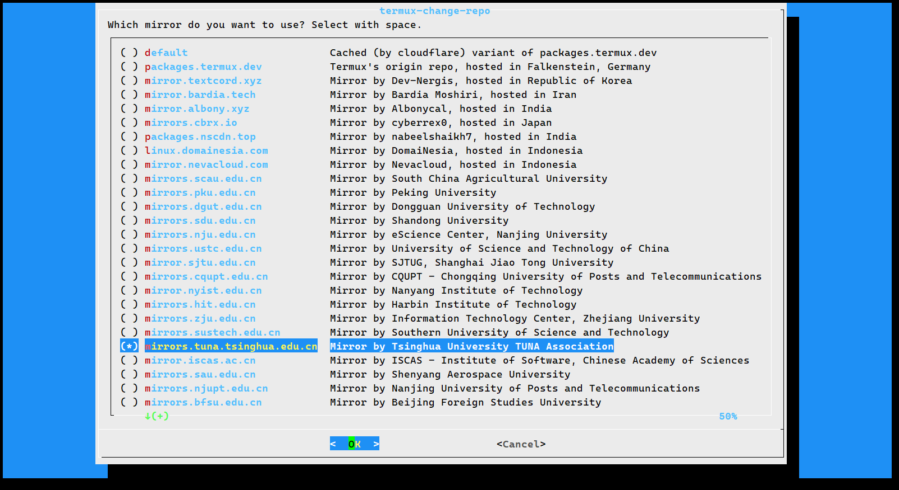
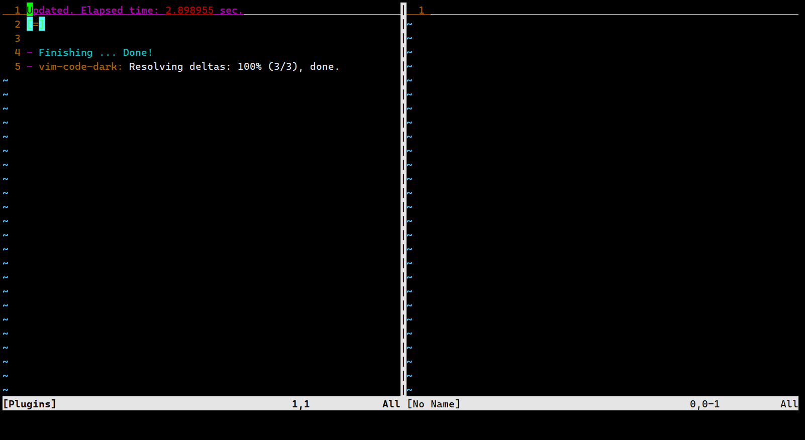
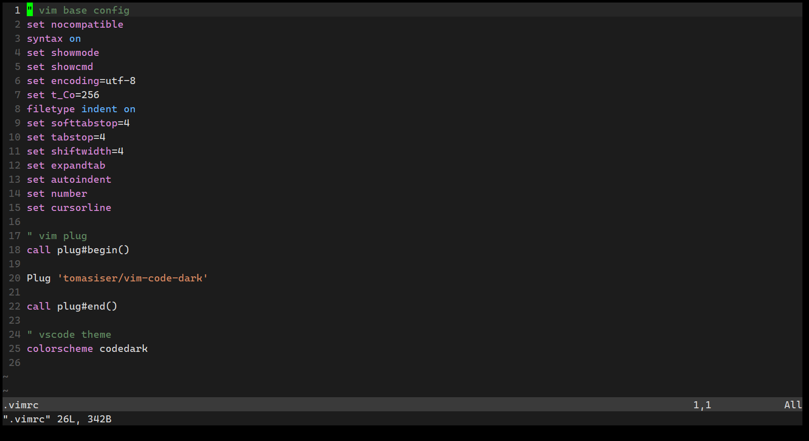
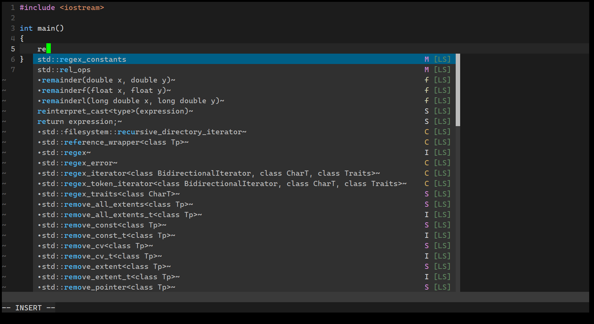
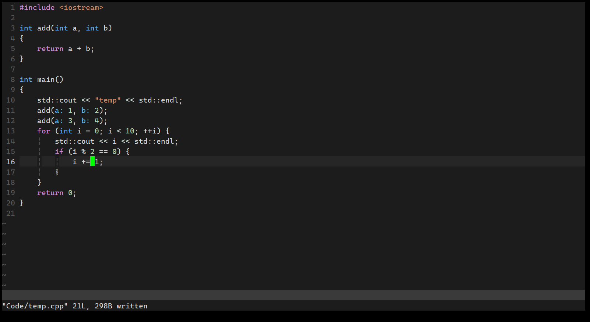

# Termux配置Vim C++开发环境，打造基于终端命令行的IDE

主要利用Vim+Coc插件，配置C++的代码提示等功能。

# Termux换源

打开termux，输入`termux-change-repo`

找到**mirrors.tuna.tsinghua.edu.cn**，清华源，空格选中，回车确认



# Termux配置ssh

有了ssh后，就可以方便的在PC或者其它平台上，使用ssh工具远程termux终端了

```shell
# 安装
apt install open-ssh
# 启动sshd，默认端口为8022
sshd
# 关闭sshd
pkill sshd
# 查看sshd是否运行
ps aux | grep sshd
```

默认没有密码，使用`passwd`命令配置密码

```shell
ssh user@192.168.0.11 -p 8022
```

user用户名可以用`whoami`命令查看，一般termux用户名为u0_xxxx

# 软件包管理简介

termux使用pkg管理软件包，并且可以使用`apt`别名

例如更新仓库和软件：

```shell
pkg update
apt update
pkg upgrade
apt upgrade
```

两个命令都可以，`apt`命令对使用过Debian的人非常友好。以下全部使用`apt`

安装命令就是

```shell
apt install xxx
```

# 安装基础软件

- vim：编辑器
- clang：C++编译器，并且提供了g++别名
- cmake：管理C++项目配置
- git：源码仓库工具
- nodejs：C++开发很少用到nodejs，主要是为vim插件提供运行环境
- python3：提供环境

```shell
apt install vim clang cmake git nodejs python3
```

# Vim基础配置

主要配置缩进、tab空格、文件编码、行号等，可以根据自己的需求配置

配置项非常少，很基础

```shell
vim .vimrc
```

编辑`.vimrc`文件，将以下内容输入

```vim
" vim base config
set nocompatible
syntax on
set showmode
set showcmd
set encoding=utf-8
set t_Co=256
filetype indent on
set softtabstop=4
set tabstop=4
set shiftwidth=4
set expandtab
set autoindent
set number
set cursorline
```

# 安装Vim插件

- VimPlug：用来管理Vim插件，之后的插件都需要用它来安装
- vim-code-dark：VsCode主题

## VimPlug插件管理

[VimPlug主页](https://github.com/junegunn/vim-plug)提供了安装方法

复制下面的命令到终端并执行

```shell
curl -fLo ~/.vim/autoload/plug.vim --create-dirs \
    https://raw.githubusercontent.com/junegunn/vim-plug/master/plug.vim
```

安装完成后编辑`.vimrc`文件，添加如下代码段

```vim
" plugin
call plug#begin()

Plug 'xxx'

call plug#end()
```

中间的`Plug 'xxx'`，就是代表安装xxx插件，每个插件一行

每当想安装新的插件时，先编辑vimrc，再重新进入vim命令模式，输入`:PlugInstall`就会安装插件

卸载插件时，编辑vimrc，删除插件那一行，然后进入vim命令模式，输入`:PlugClean`，不在列表里的插件就会被清理

`:PlugUpdate`更新插件

`:PlugUpgrade`更新VimPlug本身

## VsCode颜色主题

Vim自己的高亮不好看，我选择了VsCode主题

```vim
Plug 'tomasiser/vim-code-dark'
```

添加上述代码，重新打开vim并运行`PlugInstall`，出现Finishing ... Done!且插件名称后面显示100%时，说明安装成功



再次编辑vimrc，添加如下代码

```vim
colorscheme codedark
```

再次打开vim时，已经变为VsCode主题



## Coc代码提示

参考[Coc主页](https://github.com/neoclide/coc.nvim)，安装方式如下：

```vim
Plug 'neoclide/coc.nvim', {'branch': 'release'}
```

同样，运行`:PlugInstall`就可以安装，Coc依赖于NodeJs

Coc是类似VimPlug的管理工具，具体的语言支持还需要安装语言包

其插件列表可以在[CocWiki](https://github.com/neoclide/coc.nvim/wiki/Using-coc-extensions#implemented-coc-extensions)看到

注意，这里的插件指的是Coc插件，他们往往都按照coc-xxx命名，例如coc-clangd、coc-json等

安装插件需要使用`:CocInstall`命令，例如：

```vim
CocInstall coc-json coc-tsserver
```

Coc也需要配置，配置很多，我也没看明白，官网给了一个示例，主要是配置快捷键补全等功能。

对于C++开发环境，需要的Coc插件有

- coc-clangd：提供C++语言服务支持
- coc-cmake：提供cmake支持

### coc-clangd

安装coc-clangd，依赖于clangd，在termux中使用`apt install clang`来安装

```vim
:ConInstall coc-clangd
```

安装完成后，可以编辑一个cpp文件尝试效果，Tab用来选择候选项，Enter用来确认

对于多文件项目或者CMake项目，插件需要读取`compile_commands.json`文件，这个文件需要在编译时生成。

CMake在构建项目时生成该文件，指令为：


```shell
cmake -S . -B build -DCMAKE_BUILD_TYPE=Debug -DCMAKE_EXPORT_COMPILE_COMMANDS=TRUE
```

- `-S`指定源代码文件夹
- `-B`指定输出目录
- `-DCMAKE_BUILD_TYPE`设置构建类型
- `-DCMAKE_EXPORT_COMPILE_COMMANDS`指定生成`compile_commands.json`文件




### coc-cmake

依赖cmake lsp

```shell
pip install cmake-language-server
```

```vim
:CocInstall coc-cmake
```

然后就可以使用了

## 括号补全

使用auto-pairs插件

```vim
Plug 'jiangmiao/auto-pairs'
```

无需任何配置

## 代码格式化

使用vim-clang-format插件，参考其[主页](https://github.com/rhysd/vim-clang-format)安装

依赖于clang-format，在Termux下，安装clang就行

```vim
Plug 'rhysd/vim-clang-format'
```

安装完成后，可以参考如下代码或者[ClangFormat主页](https://github.com/rhysd/vim-clang-format)配置格式化风格：

```vim
let g:clang_format#code_style='WebKit'
```

格式化命令为`:ClangFormat`

为了方便，把`Ctrl+Shift+i`映射为该命令，在常规模式下有效：

```vim
nnoremap <C-S-i> :ClangFormat<CR>
```

## 缩进参考线

indentLine插件

```vim
Plug 'Yggdroot/indentLine'
```

无需配置



# 最终vimrc源码

```vim
" vim base config
set nocompatible
syntax on
set showmode
set showcmd
set encoding=utf-8
set t_Co=256
filetype indent on
set softtabstop=4
set tabstop=4
set shiftwidth=4
set expandtab
set autoindent
set number
set cursorline

" vim plug
call plug#begin()

Plug 'tomasiser/vim-code-dark'
Plug 'neoclide/coc.nvim', {'branch': 'release'}
Plug 'jiangmiao/auto-pairs'
Plug 'rhysd/vim-clang-format'
Plug 'Yggdroot/indentLine'

call plug#end()

" vscode theme
colorscheme codedark
" Clang Format
let g:clang_format#code_style='WebKit'
nnoremap <C-S-i> :ClangFormat<CR>


" =================================== Coc Config ==================
" Use tab for trigger completion with characters ahead and navigate
" NOTE: There's always complete item selected by default, you may want to enable
" no select by `"suggest.noselect": true` in your configuration file
" NOTE: Use command ':verbose imap <tab>' to make sure tab is not mapped by
" other plugin before putting this into your config
inoremap <silent><expr> <TAB>
      \ coc#pum#visible() ? coc#pum#next(1) :
      \ CheckBackspace() ? "\<Tab>" :
      \ coc#refresh()
inoremap <expr><S-TAB> coc#pum#visible() ? coc#pum#prev(1) : "\<C-h>"

" Make <CR> to accept selected completion item or notify coc.nvim to format
" <C-g>u breaks current undo, please make your own choice
inoremap <silent><expr> <CR> coc#pum#visible() ? coc#pum#confirm()
                              \: "\<C-g>u\<CR>\<c-r>=coc#on_enter()\<CR>"

function! CheckBackspace() abort
  let col = col('.') - 1
  return !col || getline('.')[col - 1]  =~# '\s'
endfunction

" Use <c-space> to trigger completion
if has('nvim')
  inoremap <silent><expr> <c-space> coc#refresh()
else
  inoremap <silent><expr> <c-@> coc#refresh()
endif

" Use `[g` and `]g` to navigate diagnostics
" Use `:CocDiagnostics` to get all diagnostics of current buffer in location list
nmap <silent> [g <Plug>(coc-diagnostic-prev)
nmap <silent> ]g <Plug>(coc-diagnostic-next)

" GoTo code navigation
nmap <silent> gd <Plug>(coc-definition)
nmap <silent> gy <Plug>(coc-type-definition)
nmap <silent> gi <Plug>(coc-implementation)
nmap <silent> gr <Plug>(coc-references)

" Use K to show documentation in preview window
nnoremap <silent> K :call ShowDocumentation()<CR>

function! ShowDocumentation()
  if CocAction('hasProvider', 'hover')
    call CocActionAsync('doHover')
  else
    call feedkeys('K', 'in')
  endif
endfunction

" Highlight the symbol and its references when holding the cursor
autocmd CursorHold * silent call CocActionAsync('highlight')

" Symbol renaming
nmap <leader>rn <Plug>(coc-rename)

" Formatting selected code
xmap <leader>f  <Plug>(coc-format-selected)
nmap <leader>f  <Plug>(coc-format-selected)

augroup mygroup
  autocmd!
  " Setup formatexpr specified filetype(s)
  autocmd FileType typescript,json setl formatexpr=CocAction('formatSelected')
  " Update signature help on jump placeholder
  autocmd User CocJumpPlaceholder call CocActionAsync('showSignatureHelp')
augroup end

" Applying code actions to the selected code block
" Example: `<leader>aap` for current paragraph
xmap <leader>a  <Plug>(coc-codeaction-selected)
nmap <leader>a  <Plug>(coc-codeaction-selected)

" Remap keys for applying code actions at the cursor position
nmap <leader>ac  <Plug>(coc-codeaction-cursor)
" Remap keys for apply code actions affect whole buffer
nmap <leader>as  <Plug>(coc-codeaction-source)
" Apply the most preferred quickfix action to fix diagnostic on the current line
nmap <leader>qf  <Plug>(coc-fix-current)

" Remap keys for applying refactor code actions
nmap <silent> <leader>re <Plug>(coc-codeaction-refactor)
xmap <silent> <leader>r  <Plug>(coc-codeaction-refactor-selected)
nmap <silent> <leader>r  <Plug>(coc-codeaction-refactor-selected)

" Run the Code Lens action on the current line
nmap <leader>cl  <Plug>(coc-codelens-action)

" Map function and class text objects
" NOTE: Requires 'textDocument.documentSymbol' support from the language server
xmap if <Plug>(coc-funcobj-i)
omap if <Plug>(coc-funcobj-i)
xmap af <Plug>(coc-funcobj-a)
omap af <Plug>(coc-funcobj-a)
xmap ic <Plug>(coc-classobj-i)
omap ic <Plug>(coc-classobj-i)
xmap ac <Plug>(coc-classobj-a)
omap ac <Plug>(coc-classobj-a)

" Remap <C-f> and <C-b> to scroll float windows/popups
if has('nvim-0.4.0') || has('patch-8.2.0750')
  nnoremap <silent><nowait><expr> <C-f> coc#float#has_scroll() ? coc#float#scroll(1) : "\<C-f>"
  nnoremap <silent><nowait><expr> <C-b> coc#float#has_scroll() ? coc#float#scroll(0) : "\<C-b>"
  inoremap <silent><nowait><expr> <C-f> coc#float#has_scroll() ? "\<c-r>=coc#float#scroll(1)\<cr>" : "\<Right>"
  inoremap <silent><nowait><expr> <C-b> coc#float#has_scroll() ? "\<c-r>=coc#float#scroll(0)\<cr>" : "\<Left>"
  vnoremap <silent><nowait><expr> <C-f> coc#float#has_scroll() ? coc#float#scroll(1) : "\<C-f>"
  vnoremap <silent><nowait><expr> <C-b> coc#float#has_scroll() ? coc#float#scroll(0) : "\<C-b>"
endif

" Use CTRL-S for selections ranges
" Requires 'textDocument/selectionRange' support of language server
nmap <silent> <C-s> <Plug>(coc-range-select)
xmap <silent> <C-s> <Plug>(coc-range-select)

" Add `:Format` command to format current buffer
command! -nargs=0 Format :call CocActionAsync('format')

" Add `:Fold` command to fold current buffer
command! -nargs=? Fold :call     CocAction('fold', <f-args>)

" Add `:OR` command for organize imports of the current buffer
command! -nargs=0 OR   :call     CocActionAsync('runCommand', 'editor.action.organizeImport')

" Add (Neo)Vim's native statusline support
" NOTE: Please see `:h coc-status` for integrations with external plugins that
" provide custom statusline: lightline.vim, vim-airline
set statusline^=%{coc#status()}%{get(b:,'coc_current_function','')}

" Mappings for CoCList
" Show all diagnostics
nnoremap <silent><nowait> <space>a  :<C-u>CocList diagnostics<cr>
" Manage extensions
nnoremap <silent><nowait> <space>e  :<C-u>CocList extensions<cr>
" Show commands
nnoremap <silent><nowait> <space>c  :<C-u>CocList commands<cr>
" Find symbol of current document
nnoremap <silent><nowait> <space>o  :<C-u>CocList outline<cr>
" Search workspace symbols
nnoremap <silent><nowait> <space>s  :<C-u>CocList -I symbols<cr>
" Do default action for next item
nnoremap <silent><nowait> <space>j  :<C-u>CocNext<CR>
" Do default action for previous item
nnoremap <silent><nowait> <space>k  :<C-u>CocPrev<CR>
" Resume latest coc list
nnoremap <silent><nowait> <space>p  :<C-u>CocListResume<CR>


```
